# From Prototype to Production in Minutes: CI/CD for Databricks AI/BI Genie Spaces

*How SpaceOps enables business teams to safely deploy AI-powered analytics across environments*

---

## The Rise of AI-Powered Business Intelligence

Business intelligence is undergoing its biggest transformation in decades. With **Databricks AI/BI Genie**, business users can now ask questions in plain English and get instant answers from their data—no SQL expertise required.

Imagine a finance analyst asking:
> "What was our total cloud spend last quarter by product type?"

And receiving an accurate, real-time answer in seconds. That's the power of Genie.

**But here's the challenge:** Building a great Genie space in development is just the beginning. How do you safely promote it to production where real business decisions are made?

---

## The CI/CD Imperative: Accelerating Time to Market

In today's competitive landscape, speed matters. Organizations that can turn data insights into production-ready tools faster gain a significant advantage.

**Traditional BI deployment looks like this:**

```
Analyst builds dashboard → IT reviews → Manual deployment → Weeks of waiting
```

**Modern CI/CD-enabled deployment:**

```mermaid
flowchart LR
    A["👩‍💼 Analyst builds<br/>Genie space"] --> B["✅ Automated<br/>validation"]
    B --> C["🚀 Auto-deploy<br/>to DEV"]
    C --> D["👤 Approve"]
    D --> E["🏭 Production<br/>in minutes"]
    
    style A fill:#e1f5fe
    style B fill:#fff3e0
    style C fill:#e8f5e9
    style D fill:#fce4ec
    style E fill:#f3e5f5
```



The difference? **Weeks vs. minutes.**

CI/CD (Continuous Integration/Continuous Deployment) isn't just for software engineers anymore. Business intelligence teams need the same capabilities:

- ✅ **Version control** - Track every change, roll back if needed
- ✅ **Automated testing** - Validate before deploying
- ✅ **Environment promotion** - Dev → Staging → Production
- ✅ **Approval gates** - Human oversight where it matters
- ✅ **Audit trail** - Know who changed what, and when

---

## The Problem: Genie Spaces in the Wild West

Let's be honest about the current state of Genie space management:

### Scenario 1: The Copy-Paste Nightmare
Sarah from Finance built an amazing billing analytics Genie space in the dev workspace. Now she needs to deploy it to production. Her options?

1. **Manually recreate it** - Click through the UI, hoping she remembers every setting
2. **Ask IT** - Submit a ticket, wait days for someone to figure it out
3. **Export/Import JSON** - Hope nothing breaks when the warehouse ID is different

### Scenario 2: Configuration Drift
Three months later, someone "fixes" something in production. Now prod and dev are different. Which one is correct? Nobody knows.

### Scenario 3: The Rollback Disaster
A well-meaning update breaks the Genie space. Business users are stuck. There's no easy way to go back to "yesterday's version."

**The root cause?** Genie spaces are treated as UI configurations, not as code. And anything not treated as code eventually becomes unmaintainable.

---

## Enter SpaceOps: CI/CD for Genie Spaces

**SpaceOps** is an open-source CLI tool that brings DevOps best practices to Databricks Genie spaces. It's built on a simple principle:

### Architecture Overview

```mermaid
flowchart TB
    subgraph "Development"
        UI[("🎨 Databricks UI<br/>Build Genie Space")]
        DEV_WS[("☁️ DEV Workspace")]
    end
    
    subgraph "SpaceOps CLI"
        SNAPSHOT["📸 spaceops snapshot"]
        VALIDATE["✅ spaceops validate"]
        PUSH["🚀 spaceops push"]
        DIFF["🔍 spaceops diff"]
    end
    
    subgraph "Version Control"
        GIT[("📁 Git Repository<br/>space.yaml")]
        PR["🔀 Pull Request"]
    end
    
    subgraph "CI/CD"
        GHA["⚡ GitHub Actions"]
    end
    
    subgraph "Production"
        PROD_WS[("☁️ PROD Workspace")]
        APPROVE["👤 Approval Gate"]
    end
    
    UI --> DEV_WS
    DEV_WS --> SNAPSHOT
    SNAPSHOT --> GIT
    GIT --> PR
    PR --> GHA
    GHA --> VALIDATE
    VALIDATE --> PUSH
    PUSH --> DEV_WS
    PUSH --> APPROVE
    APPROVE --> PROD_WS
    
    GIT --> DIFF
    DIFF --> DEV_WS
```



> *Genie spaces should be version-controlled, tested, and deployed just like any other business-critical asset.*

### What SpaceOps Does

| Capability | Description |
|------------|-------------|
| **Snapshot** | Export any Genie space to a YAML file |
| **Push** | Deploy a space definition to any workspace |
| **Diff** | See exactly what changed between local and remote |
| **Validate** | Check your configuration before deploying |
| **Promote** | Move spaces between environments safely |

### Installation

```bash
pip install spaceops
```

Yes, it's that simple.

---

## Real-World Scenario: Sarah's Journey

Let's follow Sarah, a Finance Analyst at Acme Corp, as she builds and deploys a billing analytics Genie space.

### The Complete Workflow

```mermaid
sequenceDiagram
    participant Sarah as 👩‍💼 Sarah<br/>(Analyst)
    participant UI as 🎨 Databricks UI
    participant DEV as ☁️ DEV Workspace
    participant CLI as 💻 SpaceOps CLI
    participant Git as 📁 GitHub
    participant CI as ⚡ GitHub Actions
    participant PROD as 🏭 PROD Workspace
    
    Note over Sarah,PROD: Step 1-2: Build & Snapshot
    Sarah->>UI: Creates Genie Space
    UI->>DEV: Deployed to DEV
    Sarah->>CLI: spaceops snapshot
    CLI->>DEV: Fetches configuration
    CLI->>Sarah: billing-analytics.yaml
    
    Note over Sarah,PROD: Step 3-4: Version Control
    Sarah->>Git: git commit & push
    Git->>Git: PR Review
    
    Note over Sarah,PROD: Step 5-6: CI/CD Pipeline
    Git->>CI: Triggers workflow
    CI->>CLI: spaceops validate
    CI->>CLI: spaceops push (DEV)
    CLI->>DEV: Updates DEV space
    CI->>CI: ⏸️ Awaits approval
    Sarah->>CI: ✅ Approves
    CI->>CLI: spaceops push (PROD)
    CLI->>PROD: Deploys to PROD
    
    Note over Sarah,PROD: Step 7: Rollback (if needed)
    Sarah->>Git: git revert
    Git->>CI: Auto-redeploy
    CI->>PROD: Restores previous version
```



### Step 1: Building the Genie Space in Development

Sarah opens Databricks and creates a new Genie space in the **dev workspace**. She:

- Adds the `billing.usage` and `billing.list_prices` tables
- Configures column settings for better AI understanding
- Writes instructions: *"When calculating costs, join usage with list_prices on sku_name"*
- Tests with sample questions until it works perfectly

After an hour of refinement, her Genie space answers business questions accurately:

> "Show me top 5 cost centers by cloud spend this month"

✅ Works perfectly in dev.

### Step 2: Snapshot - Capturing the Configuration

Sarah knows better than to manually recreate this in production. She opens her terminal:

```bash
export DATABRICKS_HOST="https://dev-workspace.databricks.com"
export DATABRICKS_TOKEN="dapi..."

spaceops snapshot 01f0f919... -o billing-analytics.yaml
```

**Output:**
```
✓ Snapshot saved to billing-analytics.yaml
╭──────────────────────────────────────────╮
│ Space: Billing Analytics                 │
│ Tables: 2                                │
│ Instructions: 4                          │
│ Example queries: 3                       │
╰──────────────────────────────────────────╯
```

Now she has her entire Genie space as code:

```yaml
# billing-analytics.yaml
title: "Billing Analytics"
description: "AI-powered billing insights"
warehouse_id: "dev-warehouse-123"

data_sources:
  tables:
    - identifier: "billing.usage"
      column_configs:
        - column_name: "sku_name"
          enable_entity_matching: true
        - column_name: "usage_quantity"
          enable_format_assistance: true

instructions:
  - content: "When calculating costs, join usage with list_prices on sku_name"
  - content: "Group by billing_origin_product for product breakdowns"

example_queries:
  - question: "What was our total spend last month?"
    sql: "SELECT SUM(usage_quantity * price) FROM billing.usage..."
```

### Step 3: Version Control - Never Lose Work Again

Sarah commits her space definition to Git:

```bash
git add billing-analytics.yaml
git commit -m "feat: Add billing analytics Genie space"
git push
```

Now her Genie space is:
- ✅ Tracked in version control
- ✅ Reviewable by teammates
- ✅ Recoverable if anything goes wrong

### Step 4: Environment-Specific Configuration

Sarah realizes production uses different table names (`prod_billing.usage` vs `billing.usage`) and a different warehouse. She creates environment-specific versions:

```
spaces/billing-analytics/
├── dev/
│   └── space.yaml    # Dev warehouse, dev tables
└── prod/
    └── space.yaml    # Prod warehouse, prod tables
```

### Step 5: CI/CD Pipeline - Automated Deployment

Sarah's team has a simple GitHub Actions workflow:

```yaml
name: Deploy Genie Spaces

on:
  push:
    branches: [main]

jobs:
  deploy-dev:
    runs-on: ubuntu-latest
    steps:
      - uses: actions/checkout@v4
      - run: pip install spaceops
      - run: spaceops push spaces/*/dev/space.yaml
        env:
          DATABRICKS_HOST: ${{ secrets.DEV_HOST }}
          DATABRICKS_TOKEN: ${{ secrets.DEV_TOKEN }}

  deploy-prod:
    needs: deploy-dev
    environment: prod  # Requires approval
    steps:
      - uses: actions/checkout@v4
      - run: pip install spaceops
      - run: spaceops push spaces/*/prod/space.yaml
        env:
          DATABRICKS_HOST: ${{ secrets.PROD_HOST }}
          DATABRICKS_TOKEN: ${{ secrets.PROD_TOKEN }}
```

### Step 6: The Magic Moment

Sarah pushes her changes:

```bash
git push origin main
```

**What happens automatically:**

1. ✅ GitHub Actions triggers
2. ✅ SpaceOps validates the configuration
3. ✅ Deploys to DEV workspace
4. ✅ Waits for approval (prod environment protection)
5. ✅ Sarah's manager approves in GitHub
6. ✅ Deploys to PRODUCTION

**Total time from push to production: 3 minutes.**

### Step 7: The Safety Net

Two weeks later, a colleague updates the Genie space and accidentally breaks it. No problem:

```bash
git log --oneline
# abc123 fix: Update instructions (BROKEN)
# def456 feat: Add billing analytics Genie space

git revert abc123
git push
```

The CI/CD pipeline automatically redeploys the working version. Business users never notice the blip.

---

## The Bigger Picture: Governance at Scale

### Genie Space Lifecycle


As organizations scale their use of Genie, governance becomes critical:

| Challenge | SpaceOps Solution |
|-----------|-------------------|
| "Who changed the production Genie space?" | Git history shows every change with author |
| "Can we audit our AI/BI configurations?" | YAML files are human-readable, auditable |
| "How do we enforce standards?" | PR reviews before merging to main |
| "What if we need to roll back?" | `git revert` + automatic redeployment |
| "How do we manage 50+ Genie spaces?" | Same Git workflow scales to any number |

---

## Getting Started

### Option 1: Quick Start (Manual)

```bash
# Install
pip install spaceops

# Set credentials
export DATABRICKS_HOST="https://your-workspace.databricks.com"
export DATABRICKS_TOKEN="dapi..."

# Snapshot existing space
spaceops snapshot <space-id> -o my-space.yaml

# Deploy to another environment
export DATABRICKS_HOST="https://other-workspace.databricks.com"
spaceops push my-space.yaml
```

### Option 2: Full CI/CD

Clone the example repository:
```bash
git clone https://github.com/charotAmine/databricks-geniecicd
```

Add your secrets to GitHub, and you're ready to go.

---

## Conclusion

Databricks AI/BI Genie is transforming how business users interact with data. But with great power comes great responsibility—the responsibility to deploy, manage, and govern these AI-powered tools properly.

**SpaceOps bridges the gap** between the ease of building Genie spaces in the UI and the rigor required for production deployments. It brings:

- 🚀 **Speed** - Deploy in minutes, not days
- 🔒 **Safety** - Version control, rollbacks, approvals
- 📋 **Governance** - Audit trails, reviews, standards
- 🤝 **Collaboration** - Git-based workflows everyone understands

The future of business intelligence is AI-powered, and the future of AI/BI deployment is CI/CD.

**Start your journey today:**
- 📦 [SpaceOps on PyPI](https://pypi.org/project/spaceops/)
- 💻 [SpaceOps on GitHub](https://github.com/charotAmine/databricks-spaceops)
- 🚀 [CI/CD Example Repository](https://github.com/charotAmine/databricks-geniecicd)

---

*SpaceOps is an open-source project. Contributions welcome!*

